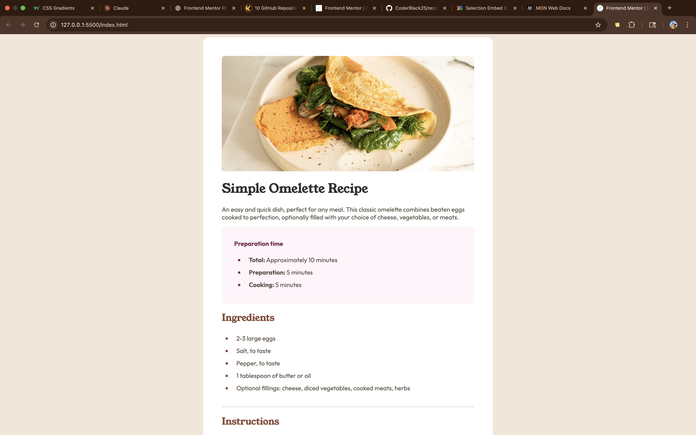

# Frontend Mentor - Recipe page solution

This is a solution to the [Recipe page challenge on Frontend Mentor](https://www.frontendmentor.io/challenges/recipe-page-KiTsR8QQKm).  
Frontend Mentor challenges help you improve your coding skills by building realistic projects.

---

## Table of contents

- [Overview](#overview)
  - [Screenshot](#screenshot)
  - [Links](#links)
- [My process](#my-process)
  - [Built with](#built-with)
  - [Key features](#key-features)
  - [What I learned](#what-i-learned)
  - [Continued development](#continued-development)
  - [Useful resources](#useful-resources)
- [Author](#author)
- [Acknowledgments](#acknowledgments)

---

## Overview

This project is a **recipe page** that presents a simple omelette recipe with preparation time, ingredients, step-by-step instructions, and nutritional information.  
It focuses on typography, spacing, and semantic HTML.

### Screenshot



(Add your screenshot here once you capture it.)

### Links

- Solution URL: (https://github.com/CoderBlack25/recipe-page)

---

## My process

### Built with

- Semantic **HTML5** markup
- **CSS custom properties**
- **Custom fonts** (`Outfit`, `Young Serif`)
- **Responsive design** with media queries
- Mobile-first workflow

### Key features

- Clear recipe layout with headings and sections
- Preparation time block with styled markers
- Ingredients and instructions with **styled lists**
- Nutrition section using a **table** with borders
- Fully responsive (desktop and mobile)

### What I learned

This project helped me practice **typography hierarchy** and **list styling** with custom markers.

Example: Custom marker styling for ordered lists:

```css
.fifth ol > li::marker {
  color: hsl(14, 45%, 36%);
  font-weight: 700;
}
```

### Continued development

In future projects, I want to:

- Improve accessibility with ARIA roles.

- Add interactive elements (e.g., “Copy ingredients” button).

- Explore using CSS Grid for more complex layouts.

### Useful resources

- MDN CSS documentation (https://developer.mozilla.org/en-US/docs/Web/CSS)

- [W3Schools HTML and CSS Tutorials] (https://www.w3schools.com)

### Author

Frontend Mentor - [@CoderBlack25](https://www.frontendmentor.io/profile/CoderBlack25)
Twitter - [@dWeb3Oracle](https://x.com/dWeb3Oracle)

### Acknowledgments

Thanks to Frontend Mentor for providing these challenges, they’re a great way to sharpen frontend skills.
